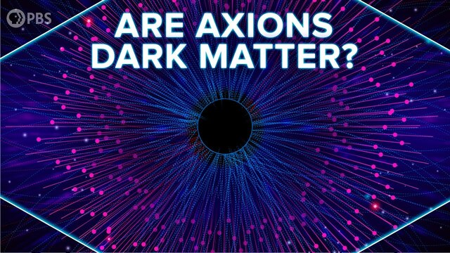
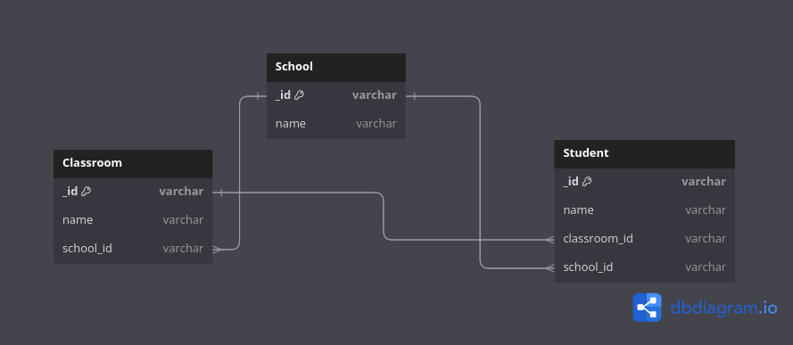

# Hamza Axion Project



## How I manged to Create The API using Axion Project ?

- ### Added Folders and Files

  - In the root directory a folder named `_common` It contains the common files I needed to use in the project. It has the error object currently.
    - In the `managers` directory I created a folder named `models` it contains mongoose models I needed to use in the project. It has:
      - `Admin` model
      - `Student` model
      - `Classroom` model
      - `School` model
  - In the `managers/api` I Created A File named `Hamza.Api.manager` it inherits from `Api.Manager` and it contains the logic to handle the API requests.

  - In the `managers/api/_common` I created a files named `Hamza.MethodMapper` and `Hamza.MethodMatrix` it contains the logic to map the request method to the functions and handel the different api endpoints. I also created the folder `controllers` it contains the controllers for the different api endpoints.

- ### How Authentication Works

  - Admins can login, logout, and be created.
  - Admins can have only one valid Token at a time.
  - Once They Login again or logout the token will be invalidated.

- ### API Documentation

  - For The API Documentation see the `API.md` file.

- ### How to Run the Project
  Make Sure You have Node.js and MongoDB installed on your machine.
  Also Make Sure You have <strong>Redis</strong> installed on your machine.
  - Clone the project
  - Run `npm install`
  - Create a `.env` file in the root directory and add the

```bash
LONG_TOKEN_SECRET=long_token_secret
SHORT_TOKEN_SECRET=short_token_secret
NACL_SECRET=nacl_secret
SERVICE_NAME=MY_SERVICE
USER_PORT=8000
ADMIN_PORT=8081
REDIS_URL=redis://localhost:6379
MONGO_URL=mongodb://localhost:27017/some_db
```

- Run `npm run dev` for development server using nodemon

- ### The Database Diagram

  
